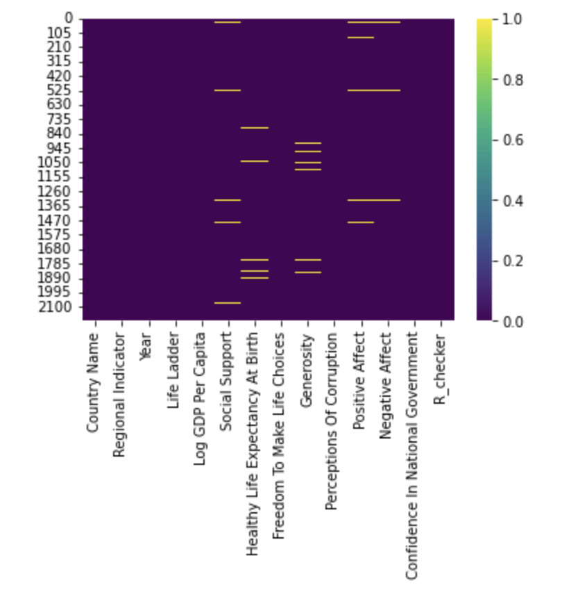

**World Happiness Report: Exploring the Impact of COVID-19 on Happiness**

Welcome to our project exploring the world of happiness and its potential connection to the COVID-19 pandemic. In this analysis, we delve into the World Happiness Report dataset to investigate whether the global health crisis has had an impact on people's well-being. Our main research question is how did the prevalence of happiness change between the pre-COVID and post-COVID eras in world countries, considering economic and social factors? 

**Our Dataset**


Our primary data source for this project is the World Happiness Report dataset, which we obtained from Kaggle (https://www.kaggle.com/datasets/usamabuttar/world-happiness-report-2005-present), a platform for data science enthusiasts and professionals. The dataset provides valuable insights into happiness scores and various factors contributing to happiness across different countries and years.

The dataset contained 13 varibles(which we only used 8 variables to test our hypothesis):
1. **Log GDP per capita**:The equation uses the natural log of GDP per capita, as this form fits the data significantly better than GDP per capita.
2. The time series for Healthy life expectancy at birth:is constructed based on data from the World Health Organization (WHO) Global Health Observatory data repository
3. Social support (0-1):is the national average of the binary responses (0=no, 1=yes) to the question “If you were in trouble, do you have relatives or friends you can count on to help you whenever you need them, or not?”
4. **Freedom to make life choices (0-1)**: is the national average of binary responses to the GWP question “Are you satisfied or dissatisfied with your freedom to choose what you do with your life?”
5. Generosity:is the residual of regressing the national average of GWP responses to the donation question “Have you donated money to a charity in the past month?” on log GDP per capita.
6. **Perceptions of corruption (0-1)**:are the average of binary answers to two GWP questions: “Is corruption widespread throughout the government or not?” and “Is corruption widespread within businesses or not?”
7. Positive affect: is defined as the average of previous-day effects measures for laughter, enjoyment, and interest. 
8. Negative affect:is defined as the average of previous-day effects measures for worry, sadness, and anger.
9. **Life Ladder(0-10)**: Represents the national average response to the question of life evaluations. 0 represents the worst possible life for you and 10 represents the best possible life for you. 
10. **Regional Indicator:** labels given to specific regions. 
11. **Year:** The years included in the dataset is 1952 - 2022.
12. **Confidence in national government:** calculated as the percentage of respondents who answer "Yes, always" or "Yes, sometimes" to: "Do you have confidence in the national government?"
13. **Country name** 


Our choices for the these varaibles were based on the following literature:
1. https://www.scirp.org/journal/paperinformation.aspx?paperid=92906
2. https://worldhappiness.report/ed/2022/
3. https://www.worldvaluessurvey.org/WVSContents.jsp

**Data: Handling Null Values, Top GDP Countries, and Pre/Post-COVID Split**


In order to handle Null values for numerical varaibles, we used linear regression model to perform regression imputation where we learn to predict missing values based on the available data.

``` import re 

#get the unique values that are NA in regional

unique_values = []
df['R_checker'] = df['Regional Indicator'].isnull()

#print(df['R_checker'])

for i,row in df.iterrows():
    #print
    #country = row['Country Name']
    if row['R_checker']==True:
        unique_values.append(row['Country Name'])
    
#values = np.array(unique_values)
holder = np.unique(unique_values)

#print the unique values
print(np.unique(unique_values))
```
Afterwards, we developed a function to handle regional indicators. This function utilized a dictionary to assign the correct countries to their respective regions. As result this removed all the null values that we intend to use to test our hyptheis:




After cleaning, we were able to comapre

## Conclusion

Our analysis of the World Happiness Report dataset reveals that COVID-19 has impacted happiness levels differently across countries. Several factors contribute to this variation, including cultural differences, the strictness of lockdown measures, cultural values, political factors, and consumerism.

Cultural factors, such as individualistic versus collectivistic cultures, influence the differential impact of the pandemic on happiness. Strictness of lockdown measures and the adaptability of countries' approaches also play a role. Additionally, traditional versus progressive values and political stability impact happiness levels during the pandemic. 

It is important to acknowledge potential biases in the data, including subjective responses and the influence of the government on respondents' answers.

Despite these limitations, our analysis provides valuable insights into the complex relationship between COVID-19 and happiness. Understanding these factors can inform policies and interventions to support well-being during crises.

This project contributes to the broader discourse on happiness and crisis resilience.


